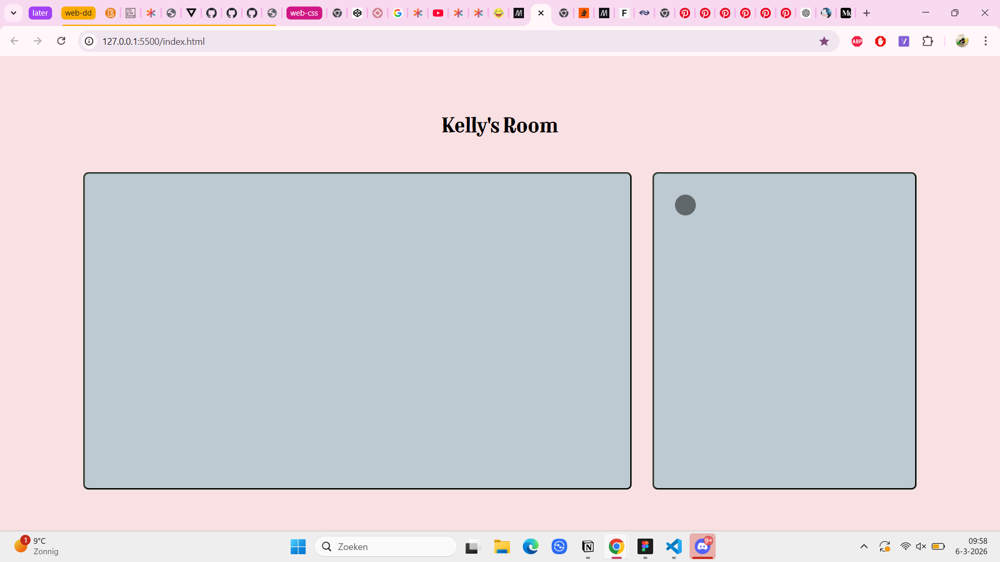
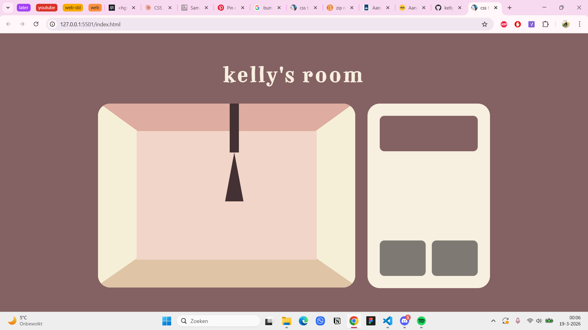
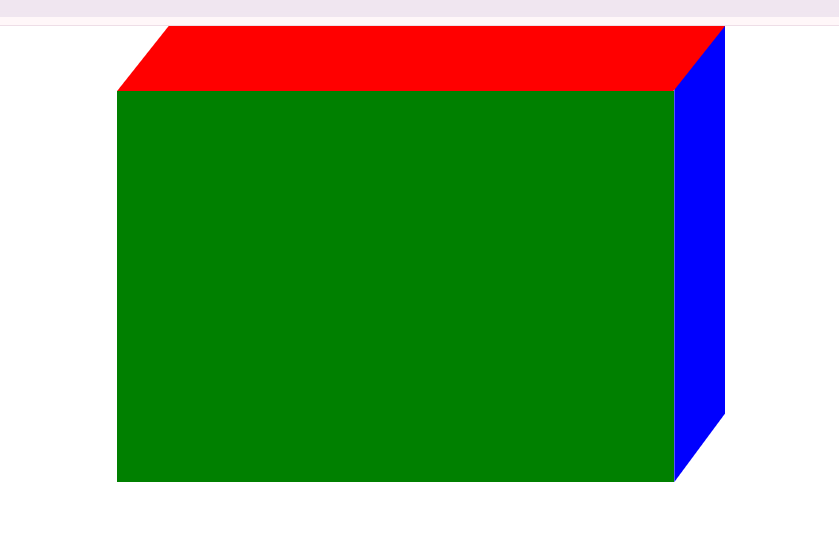
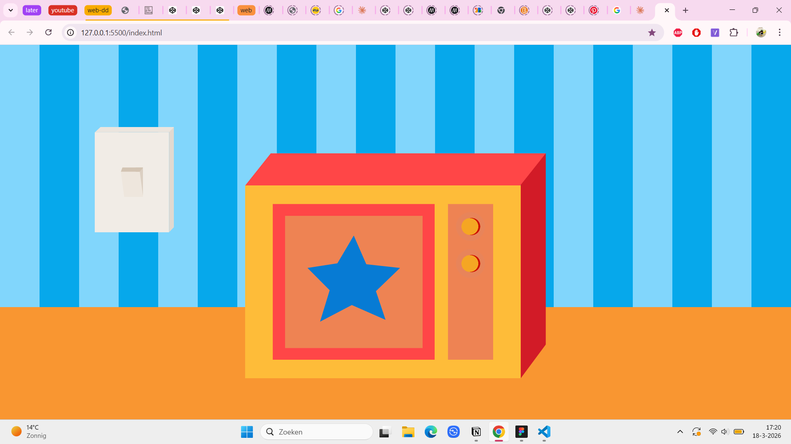
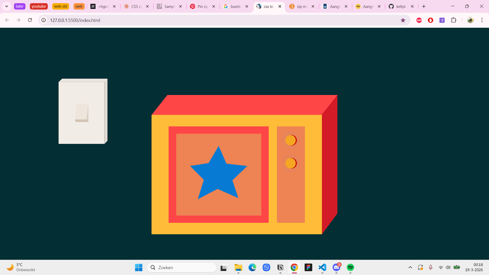

# web-dd-css-to-the-rescue

## Week 2  - woensdag 4 maart
- Wat heb ik vandaag gedaan?

Vandaag waren we eerst begonnen met de weekly nerd en hierna heb ik de opdrachten bekeken en moest ik nog even een beetje oriënteren welke ik wilde doen. Uiteindelijk heb ik de keuze gemaakt voor de control panel. Verder heb ik de workshop over gradients gevolgd van sanne en gelijk daarna de workshop van nils over advanced layouts tot half 2. 

Na de workshops hebben we even een pauze genomen en ik heb daarna om 14.00 even zitten bedenken wat ik wilde doen voor de control panel en was tot 2 keuzes gekomen namelijk een game character customizer of een control panel voor een huis.

Eerst had ik een beetje in vs code uitgeprobeerd voor de game character, maar ik ga toch voor de huis idee.

- Wat heb ik geleerd?

Ik heb nieuws geleerd over gradients en over repeating en animeren daarbij en bij nils meer geleerd over grids bijv auto fit  vs auto fill

- Wat ga ik morgen doen?

ik ga morgen een begin maken aan het huis idee en ik moet eerst nog bedenken wat ik erin wil en hoe ik dat ga doen.

## Week 2  - donderdag 5 maart
- Wat heb ik vandaag gedaan?

vandaag had ik de workshop van nils gevolgd over @property en ben ik aan de slag geweest met m’n design.  Dit had ik eerst geprobeerd gelijk in de code, maar het lukte me na een tijd niet om verder komen omdat ik geen goed zicht had. 

 Toen besloot ik om toch even over te stappen naar Figma om een me-fi te maken voor de kamer.

## Week 2  - wekelijkse reflectie
Deze week ben ik nog niet zo ver gekomen. Het opstarten voor mij ging redelijk moeilijk en ik weet niet zeker hoe ik het moet aanpakken. Dit was een lastige start, maar ik had al wel een beginnetje gemaakt.

## Week 3  - woensdag 11 maart

- Wat heb ik vandaag gedaan?

workshops, ratio aspect,  shapes
Ik heb de buttons werkend gekregen en ook de background heb ik fixed gekregen met de ratio aspect. 

- Hoe lang duurde het?
- Wat heb ik geleerd?
- Wat ga ik morgen doen?

## Week 3  - donderdag 12 maart

- Wat heb ik vandaag gedaan?

Vandaag heb ik de workshops gevolgd van sanne over masks en daarna in de middag heb ik ook nog een workshop gevolgd over variable fonts met vasilis. 

Ik heb vandaag veel video’s gekeken over clip path, want ik wil daarmee gaan werken. Dit blijkt wel moeilijker dan ik dacht, maar ik heb besloten om toch met een ander concept te beginnen. 

- Wat ga ik morgen doen?

Ik ga nu verder met een nieuw concept

## Week 3  - vrijdag 13 maart

- Wat heb ik vandaag gedaan?

Ik ben begonnen aan de tv voor mijn nieuwe concept en ik heb dit gedaan met grid en clip path. Ik heb verder gewerkt aan de eerste layout en heb al 2 knoppen werkend gekregen.

## Week 3  - wekelijkse reflectie

Omdat ik opnieuw ben begonnen loop ik weer achter, maar ik gebruik veel van de dingen die ik afgelopen week heb geleerd. Hierdoor is het proces wel soepeler gegaan. Ik had gewoon door dat als ik begin ging met de kamer dat ik gewoon niet verder kwam... ik wist niet wat ik moest doen en hoe ik dat moest aanpakken. Met de tv idee heb ik toch wel een beter grip en ik begrijp ook nu wel beter hoe ik sommige dingen moet aanpakken.

## Week 4  - woensdag 18 maart

- Wat heb ik vandaag gedaan?

Vandaag ben ik aan de slag geweest met de achtergrond en heb ik de lightswitch gemaakt. De lightswitch heeft nu controle over de achtergrond.

- Wat ga ik morgen doen?
Ik ben nu bezig met het gordijn, maar op dit moment blokkeert het de werking van de rest omdat ik het op position fixed heb en z-index hoger. Dus ik wil graag een idee bedenken voor hoe ik dat kan fixen.